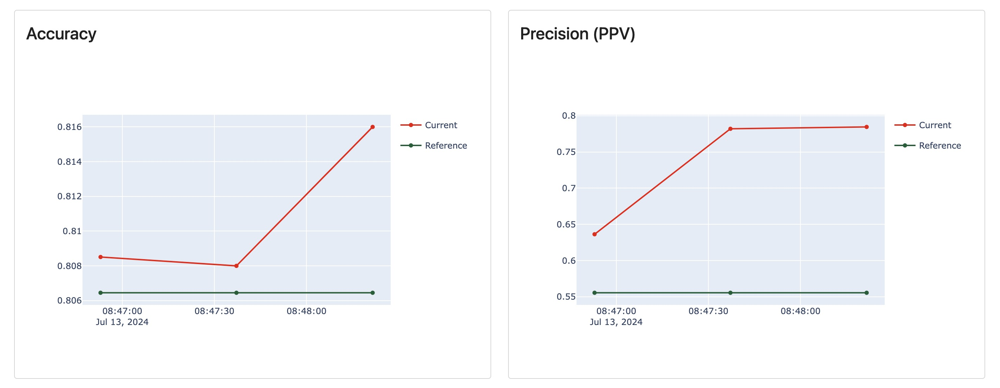
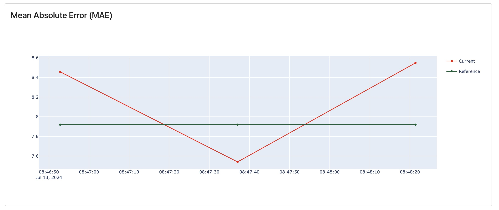

# AI Model Monitoring System Configuration Guide

## Introduction

This documentation is designed to assist users in configuring the AI Model Monitoring system developed by the AIDE Lab. The configuration should be specified in the provided `config.json` file.

## Configuration Sections

The configuration file is structured into several key sections: `model_config`, `columns`, `age_filtering`, `tests`, `dashboard_panels`, `info`, and `alerts`. Each section plays a crucial role in setting up the monitoring system accurately.

### Model Configuration (`model_config`)

This section defines the basic settings of the model. Only the values should be changed, not the keys. The `model_id` should be unique for each model, and the `model_type` should be set to `true` for the corresponding model type. 

- **model_id** (`string`): Unique identifier for the model.

- **model_type** (`object`):

  - **regression** (`boolean`): Enable if the model includes regression metrics.

  - **binary_classification** (`boolean`): Enable if the model includes binary classification metrics.

#### Example

```json
{
  "model_config": {
    "model_id": "bone_age",
    "model_type": {
      "regression": true,
      "binary_classification": true
    }
  }
}
```
### Columns

Defines the mapping of data columns to required schema properties. Only the values should be changed, not the keys. The `timestamp`, `instrument_type`, and `patient_class` fields are optional and should be set to `null` if they do not exist as columns. The `predictions` and `labels` objects should contain the column names for the predicted values and labels, respectively. The `features` array should contain the names of the additional columns in the model. *Notes: The features must be either categorical or numerical (i.e. no timestamp).*
-   **study_id** (`string`): Identifier for the study.

-   **sex** (`string`): Patient's sex.

-   **hospital** (`string`): Hospital where the data was collected.

-   **age** (`string`): Patient's age.

-   **instrument_type** (`string` or `null`): Type of instrument used to make the prediction.

-   **patient_class** (`string` or `null`): Class of the patient. Common values are `IP` (Inpatient), `OP` (Outpatient), `ED` (Emergency Department), or `ICU` (Intensive Care Unit).

-   **predictions** (`object`):
    -   **regression_prediction** (`string`): Column for predicted regression values.
    -   **classification_prediction** (`string`): Column for predicted classification values.

-   **labels** (`object`):
    -   **regression_label** (`string`): Column for regression labels.
    -   **classification_label** (`string`): Column for classification labels.

-   **features** (`array` of `string`): Names of features used in the model.

-   **timestamp** (`string`, nullable): Column for timestamp data, if applicable.

#### Example
```json
{
  "columns": {
    "study_id": "StudyID",
    "sex": "sex",
    "hospital": "hospital",
    "age": "chronological_age",
    "instrument_type": "machine_type",
    "patient_class": "patient_classification",
    "predictions": {
      "regression_prediction": "predicted_age",
      "classification_prediction": "classification"
    },
    "labels": {
      "regression_label": "label",
      "classification_label": "classification_label"
    },
    "features": [
      "upper_limit",
      "lower_limit"
    ],
    "timestamp": null
  }
}
```

### Age Filtering (`age_filtering`)
Specifies the age filtering settings for the monitoring system. The `filter_type` field should be set to one of `default` | `custom`. The `custom_ranges` field should be set to an array of objects, each containing the `min` and `max` values for the age range. *Notes: The `custom_ranges` field will only be used if the `filter_type` is set to `custom`. If an invalid `filter_type` is entered, `default` will be chosen*

- **filter_type** (`string`): Type of age filtering to be applied.

  - **`default`**: Default age filtering:
    1. Under 18
    2. 18-65
    3. Over 65

  - **`custom`**: Custom age filtering based on the `custom_ranges` field.
    1. { "min": x1, "max": y1 }
    2. { "min": x2, "max": y2 }
    3. { "min": x3, "max": y3 }


#### Example
```json
"age_filtering": {
    "filter_type": "default",
    "custom_ranges": [
      { "min": 0, "max": 0 },
      { "min": 0, "max": 0 },
      { "min": 0, "max": 0 }
    ]
  },
```

### Tests

Enables specific tests for regression and classification. To add tests, include the name of the test in its corresponding category (and the params if desired/required), as seen below and in the example to follow. For more information on any test, please check [Evidently AI](https://docs.evidentlyai.com/reference/all-tests). 

The generic thresholds for the tests are +-10% for regression and +-20% for classification. If you would like to set your own threshold for certain tests, you can use set the optional parameters of `gte` and `lte` to set the threshold, greater than or equal to and less than or equal to, respectively. Meaning, if you set the `gte` to 0.5, any value less than 0.5 will be flagged as an error. You set the success thresholds, and the system will infer the failure thresholds.

***Notes:*** *When doing a column specific test, use the exact name of the column in your Dataframe, NOT the generic config name.  If your model is either not regression or not classification, please still include the section titles (leave the lists empty)** The tests to choose from are:

#### Data Quality Tests
-   **`num_rows`**: Checks the number of rows in the dataset against the reference data.

-   **`num_cols`**: Checks the number of columns in the dataset against the reference data.

-   **`num_empty_rows`**: Checks the number of empty rows in the dataset against the reference data.

-   **`num_empty_cols`**: Checks the number of empty columns in the dataset against the reference data.

-   **`num_duplicated_rows`**: Checks the number of duplicated rows in the dataset against the reference data.

-   **`num_duplicated_cos`**: Checks the number of duplicated columns in the dataset against the reference data.

-   **`col_types`**: Checks the column types in the dataset against the reference data.

-   **`col_regex`**: Tests the number of values in a column that do not match a defined regular expression, against reference data.

    **parameters**:
    -  `column_name`: Name of the column to be tested.
    -  `regex`: Regular expression to be tested against.

-   **`num_missing_values`**: Checks the number of missing values in the dataset against the reference data.

    **parameters**:
    -  `missing_values`: (optional) List of missing values to be checked against.

-   **`share_missing_values`**: Checks the share of missing values in the dataset against the reference data.

    **parameters**:
    -  `missing_values`: (optional) List of missing values to be checked against.

-   **`num_cols_with_missing_values`**: Checks the number of columns with missing values in the dataset against the reference data.

    **parameters**:
    -  `missing_values`: (optional) List of missing values to be checked against.

-   **`num_rows_with_missing_values`**: Checks the number of rows with missing values in the dataset against the reference data.

    **parameters**:
    -  `missing_values`: (optional) List of missing values to be checked against.

-   **`test_col_range`**: Checks the range of values in a numerical column. ***Use this test to ensure that the values within a numerical column are within a defined range***

    **parameters**:
    -  `column_name`: Name of the column to be tested.
    -  `left`: Minimum value for the column.
    -  `right`: Maximum value for the column.

-   **`test_col_list`**: Checks the values in a categorical column against a set of acceptable values. **Values should not contain underscores, _** ***Use this test to ensure that the values within a categorical column are within a defined set of values.***

  **parameters**:
    -  `column_name`: Name of the column to be tested.
    -  `values`: (optional) List of acceptable values for the column.

#### Data Drift Tests
-   **`num_drifted_cols`**: Checks the number of columns that have drifted from the reference data.

  **parameters**:
    -  `columns`: (optional) List of columns to be checked for drift.
    -  Check documentation for more parameters.

-   **`share_drifted_cols`**: Checks the share of columns that have drifted from the reference data.

  **parameters**:
    -  `columns`: (optional) List of columns to be checked for drift.
    -  Check documentation for more parameters.

-   **`test_drift`**: Checks the drift of a column from the reference data.

  **parameters**:
    -  `column_name`: Name of the column to be tested.
    -  Check documentation for more parameters.

#### Regression Tests
-   **`mae`**: Computes the Mean Absolute Error (MAE) and compares it to the reference

-   **`rmse`**: Computes the Root Mean Squared Error (RMSE) and compares it to the reference

-   **`me`**: Computes the Mean Error (ME) and compares it to the reference

-   **`mape`**: Computes the Mean Absolute Percentage Error (MAPE) and compares it to the reference

-   **`abs_max_error`**: Computes the Absolute Maximum Error and compares it to the reference

-   **`r2`**: Computes the R2 score and compares it to the reference

#### Classification Tests
-   **`accuracy`**: Computes the accuracy and compares it to the reference

-   **`precision`**: Computes the precision/ppv and compares it to the reference

-   **`recall`**: Computes the recall/sensitivity/tpr and compares it to the reference

-   **`f1`**: Computes the F1 score and compares it to the reference

-   **`precision_by_class`**: Computes the precision by class and compares it to the reference

    **parameters**:
    -  `label`: Name of the class to be tested.

-   **`recall_by_class`**: Computes the recall by class and compares it to the reference

    **parameters**:
    -  `label`: Name of the class to be tested.

-   **`f1_by_class`**: Computes the F1 score by class and compares it to the reference

    **parameters**:
    -  `label`: Name of the class to be tested.

-   **`tpr`**: Computes the True Positive Rate (TPR) and compares it to the reference

-   **`tnr`**: Computes the True Negative Rate (TNR)/specificity and compares it to the reference

-   **`fpr`**: Computes the False Positive Rate (FPR)/type 1 error and compares it to the reference

-   **`fnr`**: Computes the False Negative Rate (FNR)/type 2 error and compares it to the reference

To add a test, include the name of the test in its corresponding category, and add any optional and/or required parameters to a `params` object. The `params` is optional and should only be included if the test requires additional parameters. Within the `params` object, include the required parameters for the test with the key being the parameter name and the value being the parameter value.
#### Example
```json
"tests": {
    "data_quality_tests": [
      { "name": "num_cols" },
      { "name": "num_empty_rows" },
      { "name": "num_duplicated_rows" },
      { "name": "num_duplicated_cols" },
      { "name": "col_types" },
      { "name": "num_missing_values" },
      {
        "name": "test_col_range",
        "params": {
          "column_name": "closest_age",
          "left": 0,
          "right": 216
        }
      },
      {
        "name": "test_col_list",
        "params": {
          "column_name": "hospital",
          "values": [
            "Credit Valley Hospital",
            "Mississauga Hospital",
            "Queensway Hospital"
          ]
        }
      },
      {
        "name": "test_col_list",
        "params": {
          "column_name": "patient_classification",
          "values": [
            "IP",
            "OP",
            "ED",
            "ICU"
          ]
        }
      }, 
    ],
    "data_drift_tests": [
      { "name": "num_drifted_cols" },
      { "name": "share_drifted_cols" }
    ],
    "regression_tests": [
      { 
        "name": "mae",
        "params": {
          "lte": 9.0 // SET YOUR OWN THRESHOLD
        }
      }
    ],
    "classification_tests": [
      { "name": "accuracy" },
      { "name": "precision" },
      { "name": "recall" },
      { "name": "f1" },
      { "name": "tnr" },
      { "name": "fpr" },
      { "name": "fnr" }
    ]
  },
```
### Dashboard Panels (`dashboard_panels`)

Configures the dashboard panels that will be displayed in the monitoring system. Below are all of the possible data info and metrics that can be displayed in the dashboard. Similar to the tests, any panel added to the configuration file will be shown on the dashboard. *Note: This is only for metrics and data info, tests have already been selected above, and will all be shown towards the bottom of the monitoring dashboard.*

For each panel, you must enter the name, the plot type, and the size. The list of names is below, ***if an invalid name is entered, the metric will be skipped*** (double-check!). The plot type can be one of: `line`, `bar`, `scatter`, `histogram`. If an invalid plot type is entered, the system will default to `line`. The size can be one of: `half` or `full`. If an invalid size is entered, the system will default to `half`.

Here are some sample images of the dashboard panels:

<div style="display: inline-block; text-align: center; margin-right: 10px;">
  <div style="font-size: 12px;">Sample Line Plot</div>
  
</div>
<div style="display: inline-block; text-align: center; margin-right: 10px;">
  <div style="font-size: 12px;">Sample Scatter Plot</div>
  
</div>
<div style="display: inline-block; text-align: center; margin-right: 10px;">
  <div style="font-size: 12px;">Sample Bar Plot</div>
  
</div>
<div style="display: inline-block; text-align: center;">
  <div style="font-size: 12px;">Sample Histogram Plot</div>
  
</div>

<div style="display: inline-block; text-align: center; margin-right: 10px;">
  <div style="font-size: 14px;">Half Size Panel</div>
  
</div>
<div style="display: inline-block; text-align: center;">
  <div style="font-size: 14px;">Full Size Panel </div>
  
</div>

#### Sample Panel Configuration
```json
"dashboard_panels": [
    {
        "name": "name",
        "plot_type": "line" | "bar" | "scatter" | "histogram",
        "size": "half" | "full"
    },
]
```
**Names**
- **`num_cols`**: Plots the number of columns in the dataset over time.

- **`num_rows`**: Plots the number of rows in the dataset over time.

- **`num_missing_values`**: Plots the number of missing values in the dataset over time.

- **`num_categorical_cols`**: Plots the number of categorical columns in the dataset over time.

- **`num_numeric_cols`**: Plots the number of numeric columns in the dataset over time.

- **`num_datetime_cols`**: Plots the number of datetime columns in the dataset over time.

- **`num_constant_cols`**: Plots the number of constant columns in the dataset over time.

- **`num_duplicated_cols`**: Plots the number of duplicated columns in the dataset over time.

- **`num_almost_duplicated_cols`**: Plots the number of almost duplicated columns in the dataset over time.

- **`num_empty_rows`**: Plots the number of empty rows in the dataset over time.

- **`num_empty_cols`**: Plots the number of empty columns in the dataset over time.

- **`num_duplicated_rows`**: Plots the number of duplicated rows in the dataset over time.

- **`num_drifted_cols`**: Plots the number of drifted columns in the dataset over time.

- **`share_drifted_cols`**: Plots the share of drifted columns in the dataset over time.

- **`data_drift`**: Plots the dataset drift status over time.

- **`prediction_groundtruth_drift`**: Plots the prediction and ground truth drift calculation over time.

- **`r2`**: Plots the R2 score of the regression model over time.

- **`rmse`**: Plots the Root Mean Squared Error (RMSE) of the regression model over time.

- **`me`**: Plots the Mean Error (ME) of the regression model over time.

- **`mae`**: Plots the Mean Absolute Error (MAE) of the regression model over time.

- **`mape`**: Plots the Mean Absolute Percentage Error (MAPE) of the regression model over time.

- **`abs_max_error`**: Plots the Absolute Max Error of the regression model over time.

- **`error_std`**: Plots the Error Standard Deviation of the regression model over time.

- **`abs_error_std`**: Plots the Absolute Error Standard Deviation of the regression model over time.

- **`accuracy`**: Plots the accuracy of the classification model over time.

- **`precision`**: Plots the precision/positive predictive value (PPV) of the classification model over time.

- **`recall`**: Plots the recall/sensitivity/true positive rate (TPR) of the classification model over time.

- **`f1`**: Plots the F1 score of the classification model over time.

- **`tpr`**: Plots the True Positive Rate (TPR)/Recall/Sensitivity of the classification model over time.

- **`tnr`**: Plots the True Negative Rate (TNR)/Specificity of the classification model over time.

- **`fpr`**: Plots the False Positive Rate (FPR)/Fall-Out/Type I Error Rate of the classification model over time.

- **`fnr`**: Plots the False Negative Rate (FNR)/Miss Rate/Type II Error Rate of the classification model over time.

#### Example
```json
"dashboard_panels": [
    {
      "name": "num_cols",
      "type": "bar",
      "size": "half"
    },
    {
      "name": "num_missing_values",
      "type": "line",
      "size": "half"
    },
    {
      "name": "num_empty_rows",
      "type": "line",
      "size": "half"
    },
    {
      "name": "num_drifted_cols",
      "type": "line",
      "size": "half"
    },
    {
      "name": "data_drift",
      "type": "line",
      "size": "half"
    },
    {
      "name": "mae",
      "type": "line",
      "size": "full"
    },
    ...
]
```


### Info (`info`)
Provides info about the model that will be displayed on the monitoring dashboard. The `info` object should contain the following fields:

-   **project_name** (`string`): Name of the project.

-   **project_description** (`string`): Description of the project.

-   **model_developer** (`string`): Name of the model developer.

-   **contact_name** (`string`): Name of the contact person.

-   **contact_email** (`string`): Email of the contact person.

-   **references** (`array` of `objects`): List of references for the model.

    -   **name** (`string`): Name of the reference.

    -   **url** (`string`): URL of the reference.

-   **disclaimer** (`string`): Disclaimer for the model.

-   **fact_card** (`string`): Name of the model fact card image file. Can be set to `null` if no fact card is available. ***The image file must be placed in the `frontend/dashboard/public/images` directory, or it will not be rendered.*** The image must be a `.jpg`, `.jpeg`, or `.png` file. If the image is not found, the system will default to the disclaimer text above.


#### Example
```json
"info": {
    "project_name": "Bone Age Prediction",
    "project_description": "Bone Age Prediction project",
    "model_developer": "Trillium Health Partners",
    "contact_name": "John Smith",
    "contact_email": "johnsmith@thp.ca",
    "references": [
      {
        "name": "RSNA Pediatric Bone Age Challenge 2017",
        "url": "https://www.rsna.org/education/ai-resources-and-training/ai-image-challenge/rsna-pediatric-bone-age-challenge-2017"
      }
    ],
    "disclaimer": "This model has not been evaluated to assess potential performance differentials across race and ethnicity. Socioeconomic factors are known to play a role in the development of children.",
    "fact_card": "ModelFactCard.jpg"
  },
```


### Alerts (`alerts`)

Configures alert settings for the monitoring system. Alerts are sent when the model performance falls below the specified thresholds, i.e. a test falls below or above the specified threshold.

-   **emails** (`array` of `string`): List of email addresses to receive alerts.

#### Example
```json
"alerts": {
    "emails": [
      "johndoe@gmail.com", 
      "friendofjohndoe@gmail.com"
    ]
}
````